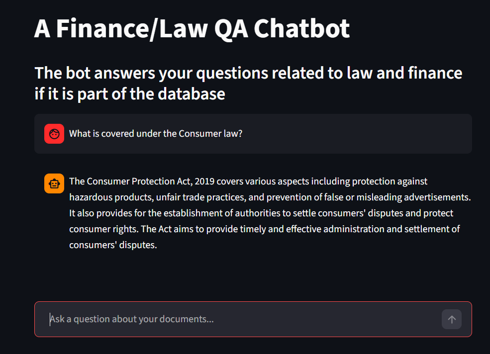

# Project Title + one liner
FinLex AI — A Local RAG-based Q&A Assistant for Finance & Legal Documents

## About
The bot answers your questions related to law and finance if it is part of the database. Takes the context it generates from user's question and promptly answers their questions

## How it works
The app works on RAG. It takes the user's query, and then generates an answer based on the context it has and what matches from the user's query. The model refuses to answer what it doesn't know instead of hallucinating.

## Tech Stack
Python            - Core Language
LangChain         - RAG Orchestration
Ollama + Llama3.2 - Local LLM Inference
Faiss             - Vector Store
Huggingface       - Embedding Model       
PyMUPdfloader     - PDF Loading  
Streamlit         - Core UI

## Setup
1. Clone the repo
2. Create a virtual environment and activate it:

```

    python -m venv rag-venv
    rag-venv\Scripts\activate 
    
```

3. Install dependencies:

    ``` 
    pip install -r requirements.txt 

    ```

4. Install Ollama from https://ollama.com and pull the model:

    ``` 
    ollama pull llama3.2 
    
    ```

5. Add your documents to the `data/` folder
6. Run the ingestion pipeline:

    ```
     
    python ingest.py 
    
    ```

## How to run
```
streamlit run app.py

```

## Screenshots


## Limitations & Roadmap
The bot is still a work in progress and hence a bit slow. the citations will be listed along with new features in the upcoming versions. 


 


